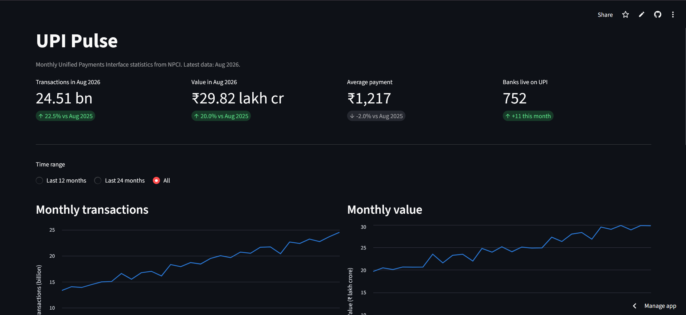
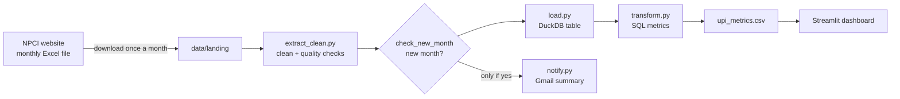
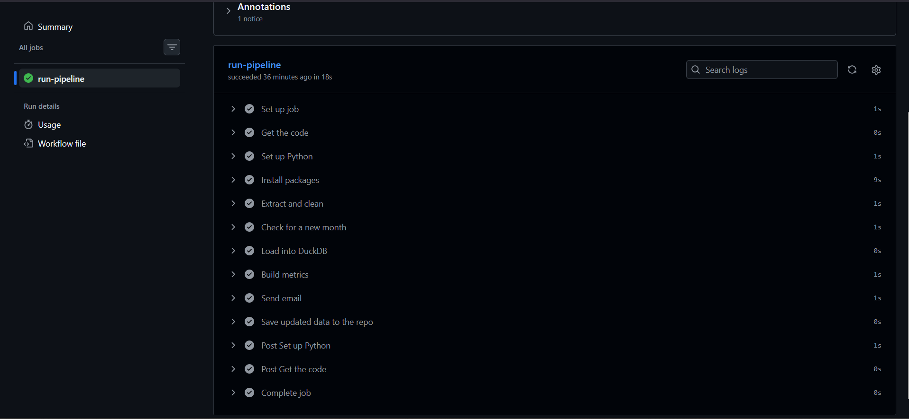
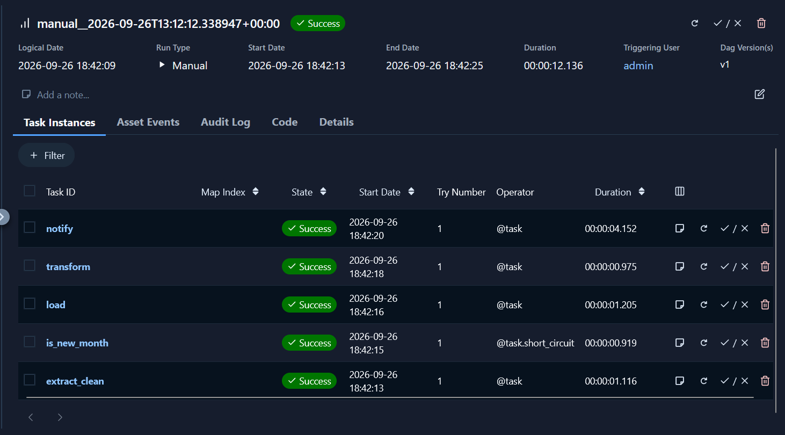
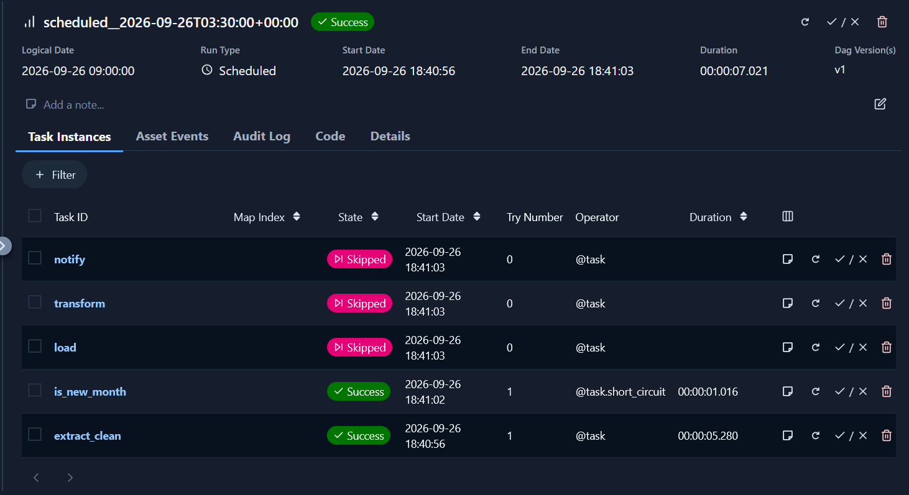
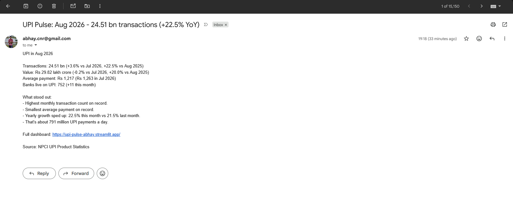

# UPI Pulse

[](https://github.com/AbhayNataraj/upi-pulse/actions/workflows/pipeline.yml)

An automated data pipeline that turns NPCI's monthly UPI statistics into a live dashboard and a monthly email summary.

**Live dashboard:** [upi-pulse-abhay.streamlit.app](https://upi-pulse-abhay.streamlit.app/)



## What it does

Every month NPCI (National Payments Corporation of India) publishes UPI transaction numbers as an Excel file. The file is small but messy: numbers stored as text, hidden tab characters, mixed comma styles, and the newest month listed first.

When a new file lands in the repo, the pipeline:

- cleans it and runs quality checks, stopping if anything looks wrong
- loads it into a DuckDB database
- builds growth and ticket-size metrics in SQL
- refreshes the live dashboard
- emails a short "what changed this month" summary, but only when there's actually a new month

It runs in the cloud on GitHub Actions, and locally as an Apache Airflow DAG.

## What the data shows

Based on data up to August 2026:

- UPI handled **24.51 billion transactions worth ₹29.82 lakh crore** in August 2026. That's about 791 million payments a day.
- Growth is slowing. Transaction count was growing 33 to 35% a year in mid-2025, and that's down to 21 to 22% by mid-2026.
- Payments are getting smaller. The average UPI payment fell from ₹1,477 in April 2024 to ₹1,217 in August 2026, about 18% lower. Value is growing slower than volume (around 20% a year), which points to UPI being used more for small everyday purchases.
- The network keeps widening. Banks live on UPI went from 583 to 752 over the same period.

## How it works



Each step is its own small script, so each one maps to one task in the Airflow DAG and one step in the GitHub Actions workflow.

| Step | Script | What it does |
|---|---|---|
| Extract + clean | `pipeline/extract_clean.py` | Reads every Excel file in `data/landing`, fixes the text numbers, converts months to dates, runs quality checks, saves one clean CSV |
| Check | `pipeline/check_new_month.py` | Compares the newest month in the files with the newest month already processed |
| Load | `pipeline/load.py` | Loads the clean CSV into a DuckDB table, rebuilt from scratch each run |
| Transform | `pipeline/transform.py` + `sql/upi_metrics.sql` | Builds month-on-month and year-on-year growth, average ticket size, daily volume and financial year |
| Notify | `pipeline/notify.py` | Writes a plain-English summary with a few rule-based highlights and sends it through Gmail |

### Two ways to run it

**GitHub Actions (cloud).** Pushing a new file to `data/landing` starts the workflow. It runs every step, emails the summary if there's a new month, and commits the updated CSVs back to the repo. Streamlit Cloud picks up the new data by itself.



**Apache Airflow (local).** The same steps as a DAG, running daily. Most days there's no new file, so the `is_new_month` short-circuit skips everything after it.

| Full run | No new data, so the run stops early |
|---|---|
|  |  |

### The monthly email



## Tech stack

- **Python** with pandas and openpyxl for reading and cleaning the Excel files
- **DuckDB** as the database, because it's a single file with no server and it speaks plain SQL
- **SQL** window functions (`LAG`) for the growth metrics
- **Streamlit** and Streamlit Community Cloud for the free, public dashboard
- **Apache Airflow 3** for orchestration, running in WSL on Windows
- **GitHub Actions** for event-driven runs in the cloud
- **Gmail SMTP** with an app password for the email, kept in a `.env` file locally and in GitHub Secrets in the cloud

## Project structure

```
upi-pulse/
├── .github/workflows/pipeline.yml   GitHub Actions workflow
├── dags/upi_pulse_dag.py            Airflow DAG
├── pipeline/
│   ├── extract_clean.py             step 1: clean + quality checks
│   ├── check_new_month.py           step 2: is there new data?
│   ├── load.py                      step 3: load into DuckDB
│   ├── transform.py                 step 4: run the SQL
│   ├── notify.py                    step 5: email summary
│   └── requirements.txt             packages for the pipeline
├── sql/upi_metrics.sql              all metric logic
├── dashboard/
│   ├── app.py                       Streamlit dashboard
│   └── requirements.txt             packages for Streamlit Cloud
├── data/
│   ├── landing/                     raw NPCI Excel files go here
│   └── processed/                   clean data and metrics CSVs
└── notebooks/01_explore_npci.ipynb  first look at the raw data
```

## Data quality checks

The pipeline stops with a clear error, rather than publishing bad numbers, if:

- a file's columns don't match NPCI's expected layout
- any value is empty after cleaning
- any volume, value or bank count is zero or negative
- a month is missing between the first and last month

The missing-month check matters for more than tidiness. The year-on-year metric uses `LAG(x, 12)`, which assumes exactly one row per month. One missing month would silently shift every comparison after it.

## Design decisions

**Manual download into a landing folder.** NPCI's website blocks automated access, so instead of scraping around that, the pipeline starts from a landing folder. Downloading one file a month takes a couple of minutes and everything after that is automatic.

**Full refresh instead of appending.** Each run rebuilds the tables from all the files. The data is tiny, and it means running the pipeline twice never creates duplicates. The pipeline is idempotent.

**Metrics in SQL, cleaning in Python.** Cleaning messy Excel is easier in pandas. Business logic like growth rates is easier to read and review in SQL, and it could move to dbt later without changing anything else.

**Only email when something changed.** Both Airflow and GitHub Actions check for a new month before sending, so a re-run or a daily schedule never sends the same summary twice. There's a `force` option for testing.

**Two requirements files for the cloud.** `pipeline/requirements.txt` and `dashboard/requirements.txt` list only what each part needs, so the cloud installs are small and don't pick up Windows-only packages.

## Run it yourself

You'll need Python 3.12 or later and Git.

```bash
git clone https://github.com/AbhayNataraj/upi-pulse.git
cd upi-pulse
python -m venv .venv
# Windows: .venv\Scripts\activate    Mac/Linux: source .venv/bin/activate
pip install -r pipeline/requirements.txt -r dashboard/requirements.txt
```

Run the pipeline one step at a time:

```bash
python pipeline/extract_clean.py
python pipeline/load.py
python pipeline/transform.py
python pipeline/notify.py        # prints the email if Gmail isn't set up
streamlit run dashboard/app.py
```

To send real emails, create a `.env` file in the project folder (it's already in `.gitignore`):

```
GMAIL_ADDRESS=you@gmail.com
GMAIL_APP_PASSWORD=your16letterapppassword
EMAIL_TO=you@gmail.com
```

The app password comes from [myaccount.google.com/apppasswords](https://myaccount.google.com/apppasswords) and needs 2-Step Verification turned on.

### Airflow

Airflow runs on Linux, so on Windows it goes inside WSL. Install it with the official constraints file, point it at this repo's `dags` folder, and start it:

```bash
export AIRFLOW_HOME=~/airflow
export AIRFLOW__CORE__DAGS_FOLDER=/path/to/upi-pulse/dags
export AIRFLOW__CORE__LOAD_EXAMPLES=False
airflow standalone
```

If port 8080 is taken on your machine, also set `AIRFLOW__API__PORT=8081` and `AIRFLOW__API__BASE_URL=http://localhost:8081`. Both are needed, or tasks can't reach the API server.

### GitHub Actions

Add `GMAIL_ADDRESS`, `GMAIL_APP_PASSWORD` and `EMAIL_TO` under Settings, Secrets and variables, Actions. The workflow runs when files in `data/landing` change, or by hand from the Actions tab.

## Monthly update

1. `git pull`
2. Download the current financial year's file from NPCI's UPI product statistics page and replace the old one in `data/landing`
3. Commit and push

The email arrives in a couple of minutes and the dashboard updates within the hour.

## What I'd add next

- More NPCI products (IMPS, FASTag, BBPS) in the same pipeline
- Move the SQL into dbt with tests
- Unit tests for the cleaning step with pytest
- Anomaly alerts when a month's growth falls well outside its usual range

## Data source

[NPCI UPI Product Statistics](https://www.npci.org.in/product/upi/product-statistics). Volumes are in millions and values in ₹ crore, as published. This is a personal project and isn't affiliated with NPCI.

---

Built by Abhay Nataraj. [LinkedIn](https://www.linkedin.com/in/abhay-nataraj-4b88891a1)
